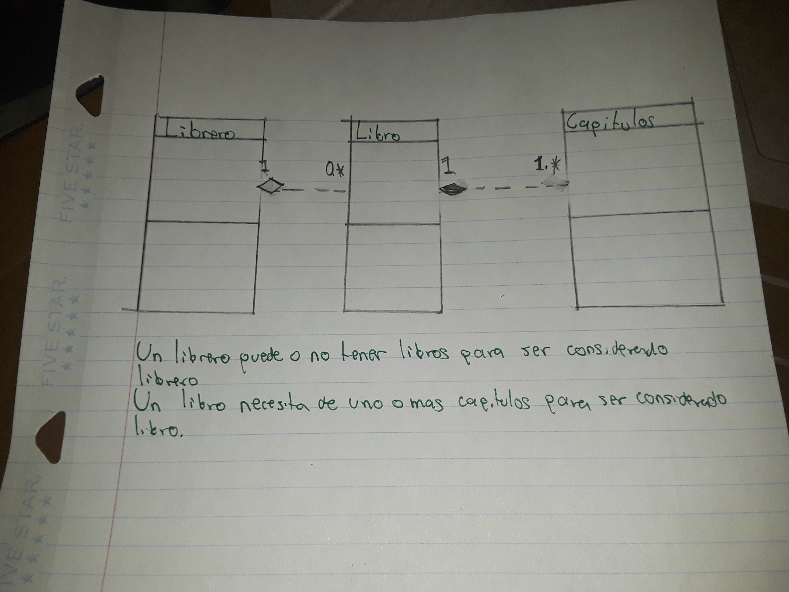

# Ejercicio de UML

Agrega la cardinalidad o multiplicidad para las asociaciones del siguiente diagrama de clases, justifica tus decisiones:

Completa los tipos de asociación (Agregación y Composición) y multiplicidad que hay entre las clases siguientes y explica porque es de ese tipo.

